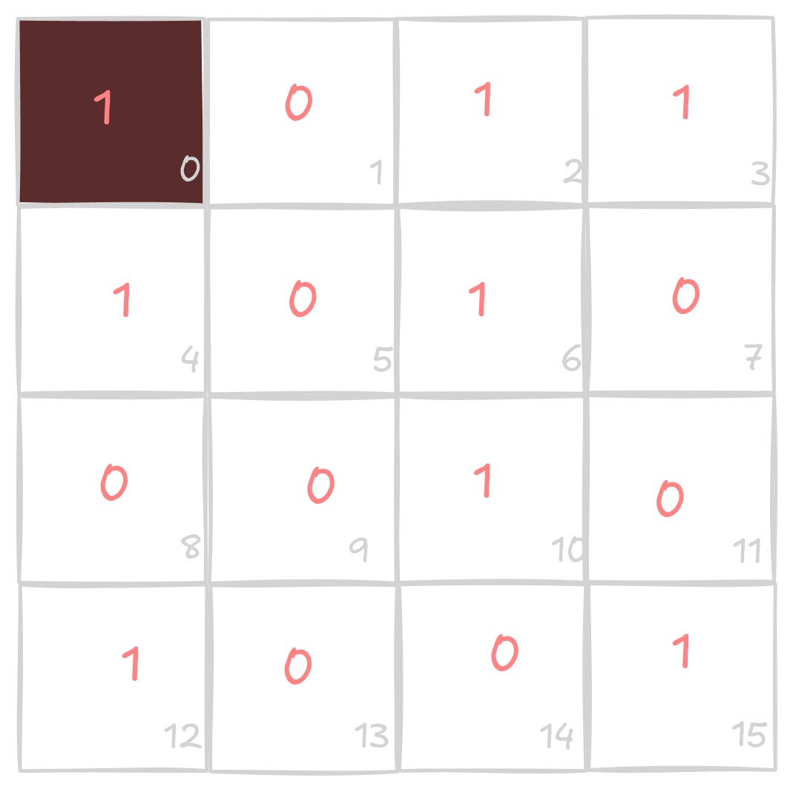
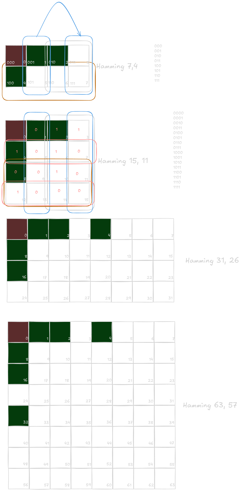

# Hamming Code

> [!INFO]
> The Hamming Code is a error-correcting code, it can report and correct for
> one-bit, and only detect if there is and error for two-bit.

For the Extended Hamming Code is possible to detect

We know that many resources, like, an audio, an image, a code, etc. Can be
converted in 1's and 0's.

## Parity:

Is the redundancy given by the # of 1's. If the # is even the Parity
will be 0, but if the # is odd the Parity will be 1.

Example:

The bit at the position 0 represents the parity in this case.

There are 6 (1's) so the parity (bit 0) is 0.

Here are 7 (1's) so the parity (bit 0) is 1.

Therefore, if there were any change in one of the 15 bits, we would
be certain that there is an error != 0, even though we do not know where it is.

